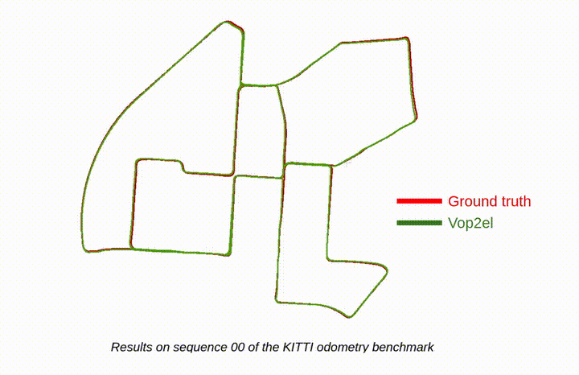

# Vop2el

The goal of this repository is to provide a stereo visual odometry algorithm based on the  methods described in [SOFT2](https://lamor.fer.hr/images/50036607/2022-cvisic-soft2-tro.pdf) paper.

Note: This algorithm relies on a known camera calibration matrix and a known extrinsic transformation between the left and right cameras of the stereo camera.



## Dependencies

This project has been tested and verified to build successfully on Ubuntu 20.04 LTS with the following dependencies.

- Eigen 3.4

- Ceres 2.2

- OpenMP

- For OpenCV, we use a slightly modified version that will be built during the build of this project.

## Build and install

To build and install this project on linux, follow the steps below:

```bash
git clone https://github.com/Vop2elToolkit/Vop2el.git

cd Vop2el && git submodule update --init --recursive

mkdir ../Vop2el-build && cd ../Vop2el-build

cmake ../Vop2el

make
```

## Run

To run this project on linux, use the following command:

```bash
./bin/Vop2elTester /path/to/left/images/folder \
                   /path/to/right/images/folder \
                   /path/to/config/ini/file \
                   /path/to/estimated/poses/text/file \
                   /path/to/ground/truth/poses/text/file(optional)
```
Notes:
- Users should rely on parameters ini file provided in test folder.
- Using ground plane adds additional overhead to processing time and requires precise values for normal vector and distance to ground plane, users should try running the program without it first and then test with it if the results are not satisfactory.  
- To improve processing time, user can reduce max_key_points_per_bin or/and (half_horizontal_search, half_vertical_search).
- In the estimated poses text file, each pose will be written as a single line representing a row-major 3x4 matrix.
- The last argument mentioned in the command above is optional. When provided, it is used solely to compute translation and rotation error metrics between the estimated and ground truth poses.

## Differences with SOFT2
| SOFT2 | Ours |
| ---                              | ---        |
| Automatic computing of ground plane normal vector and distance to ground plane | The user needs to provide the ground plane normal vector and distance to ground plane if he would like to use patch correction feature |
| Use SOFT algorithm to estimate initial relative pose | Use Lucas–Kanade optical flow to estimate initial matches, followed by a RANSAC to estimate initial relative pose |
| Bundle adjustment | No bundle adjustment
| Extrinsic camera rotation is optimized during scale computing | For now, the extrinsic camera rotation is deemed satisfactory and will not undergo optimization during the algorithm
